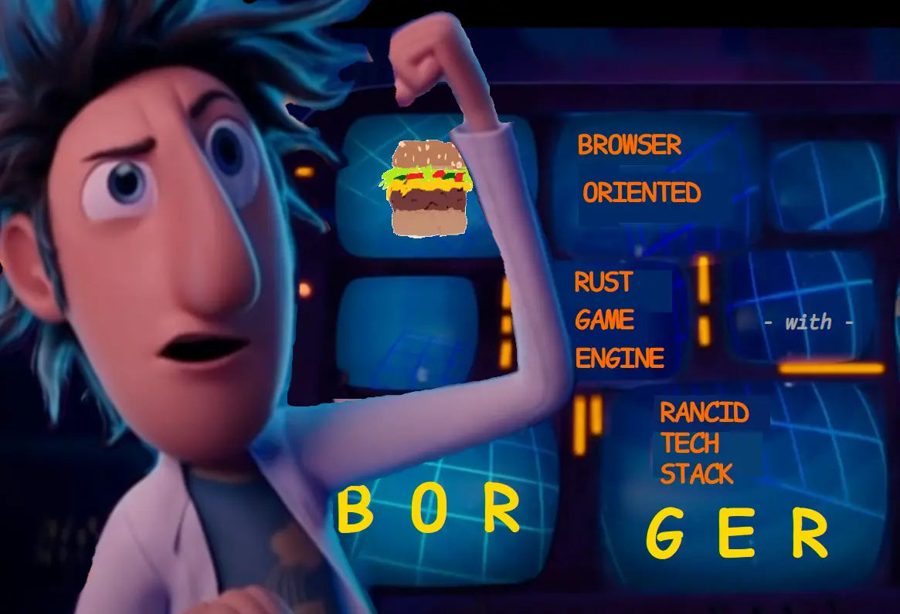
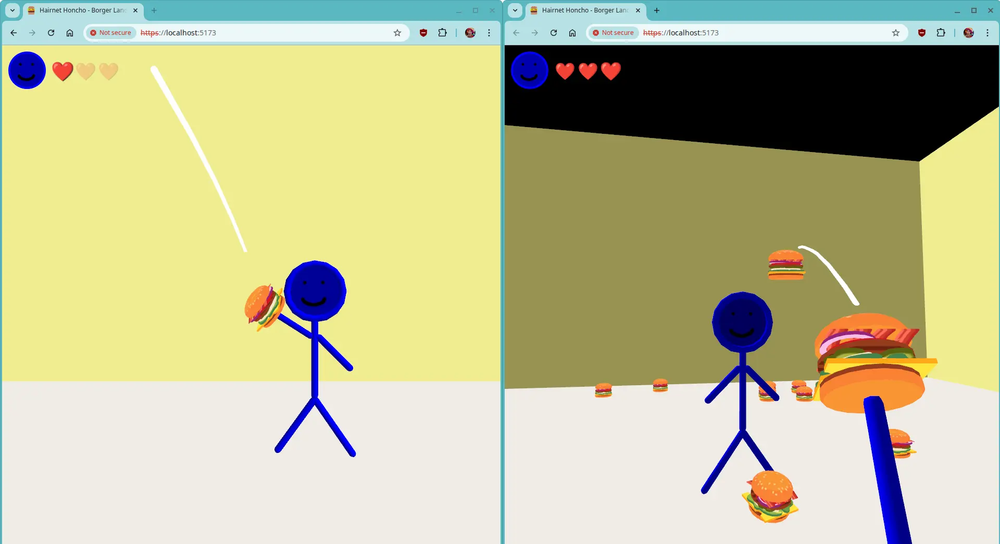
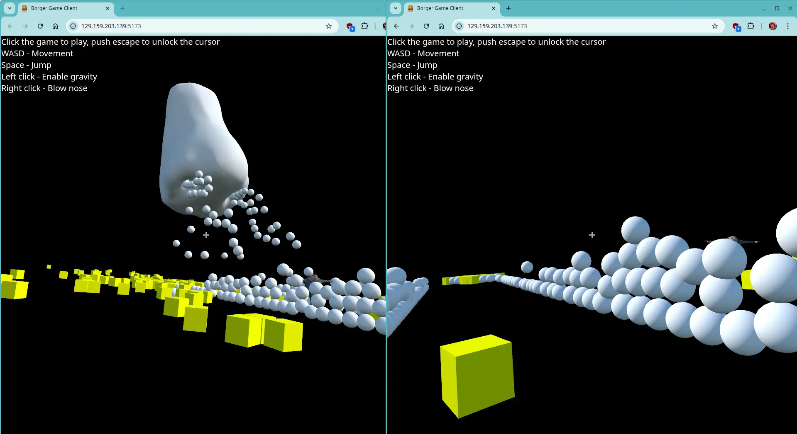
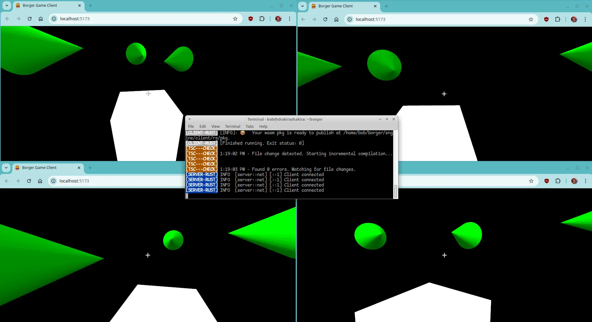

#  BORGER 

<div style="display: flex; gap: 10px;">
	
	
</div>
<br />

**Borger** is a particularly delicious Rust-based multiplayer framework that makes it quick and easy to build cheat-proof, realtime, multiplayer browser games. It works by replacing yucky brain-hurting netcode with **annotations** that distill the hard parts away into a single question: "does this game mechanic need to be responsive or correct?" Inspired by Rust's famed memory safety, Borger aims to introduce **multiplayer safety** by preventing many classes of vulnerabilities and bugs associated with multiplayer game development at compile time.

- Never ever netcode ever: Just write deceivingly simple game logic. Get server authority, client prediction, rollback, and reconciliation for free.
- Bring your own renderer: Borger is served fresh in the form of a scaffolded Vite project, allowing interoperability with your favorite hot-reloading tools: React, Three.js, or any other combo of renderers.
- Unified codebase: The same exact code produces both an efficient server executable and a client WebAssembly module.
- Vibe code friendly: Borger's API surface is modeled after what LLM's (and humans) excel at the most: declarative, composable, and delightfully puny.
- Deploy whenever, wherever: Being browser-first isn't a limitation; it's the lowest common denominator that all players can run. Wrap that Borger up in Electron and deliver it through any app store.

### The bodacious gambit: a macro called `multiplayer_tradeoff!()`

- Need an immediate response without waiting for the server? Use `Immediate` for client prediction.
- Need to hide sensitive, private data from prying clients? Use `WaitForServer` for peace of mind.
- Need guaranteed correctness at all costs? Use `WaitForConsensus` for server authority.
- That's all there is to it!

### How it works

1. **Describe** the fabric of your reality in a rich JSON schema. The shape of your game state data is used to autogenerate rollback machinery.

```typescript
characters: {
	netVisibility: "public",
	presentation: "clone",
	type: "SlotMap",
	typeName: "Character",
	content: {
		pos: { netVisibility: "public", presentation: "interpolate", type: "Vec3" },
	},
},
```

2. **Decree** in beginner Rust the laws that govern your digital realm. Simulation logic is written with simple C-like setters and getters.

```rust
fn apply_input(
	character: &mut Character,
	input: &Input,
	diff: &mut DiffSerializer<Immediate>,
) {
	let mut pos = character.get_pos();
	pos += input.omnidir * SPEED * TickInfo::SIM_DT;
	character.set_pos(pos, diff);
}
```

3. **Engrave** into the screen itself an audiovisual imagining of your dominion. Presentation logic written in typescript determines how the game looks, sounds, and feels.

```typescript
for (const [id, character] of characters) {
	const mesh = scene.getObjectByName(`character${id}`)!;
	if (localCharacterID === id) {
		mesh.visible = false;
		camera.position.copy(character.pos);
		camera.quaternion.copy(character.rot);
	} else {
		mesh.visible = true;
		mesh.position.copy(character.pos);
		mesh.quaternion.copy(character.rot);
	}
}
```

### Getting started:

- Required technomologies
    - [Git](https://git-scm.com/install/)
    - [Something capable of running Bash scripts](https://xubuntu.org/download/) (Windows victims use [WSL](https://learn.microsoft.com/en-us/windows/wsl/install))
    - [IDE](https://code.visualstudio.com/Download) (though even a text editor will do!)
- Recommended
    - VS Code extensions:
        - [rust-analyzer](https://marketplace.visualstudio.com/items?itemName=rust-lang.rust-analyzer) (this uses a ton of RAM - recommend having at least 12 GB)
        - [ESLint](https://marketplace.visualstudio.com/items?itemName=dbaeumer.vscode-eslint)
        - [Tailwind CSS IntelliSense](https://marketplace.visualstudio.com/items?itemName=bradlc.vscode-tailwindcss)
        - [Prettier](https://marketplace.visualstudio.com/items?itemName=esbenp.prettier-vscode)
            - To automatically format code each time you save, after running `setup.sh`, add this to `.vscode/settings.json`:
                ```JSON
                "editor.formatOnSave": true,
                "editor.defaultFormatter": "esbenp.prettier-vscode",
                "[rust]": {
                	"editor.defaultFormatter": "rust-lang.rust-analyzer"
                },
                ```
    - Debugging Rust code in browser devtools:
        - [Chromium](https://chromewebstore.google.com/detail/cc++-devtools-support-dwa/pdcpmagijalfljmkmjngeonclgbbannb)
        - [Firefox (unpleasant but supposedly doable)](https://github.com/jdmichaud/dwarf-2-sourcemap)
        - Safari (lol)

### Make 'em move hunny

Fork this repo first, in order to use it as a blank template. Then:

```Bash
git clone https://github.com/Username/MyGame.git
cd MyGame
./borger setup #takes ~15 min from scratch
./borger dev #wait a few seconds for it to stop spamming the console
```

Now visit https://localhost:5173 for a good meal (you'll see a security warning about self-signed certificates but you can safely dismiss it)

### Gallery





Files of interest:

- `game/state.ts` - Defines the data structure representing the entire networked scene/world
- `game/presentation/index.ts` - Presentation logic entry point (rendering, UI, audio)
- `game/simulation/lib.rs` - Simulation logic entry point (game logic)

### Acknowledgements & Inspirations

- [Fast-Paced Multiplayer](https://www.gabrielgambetta.com/client-server-game-architecture.html) - Gabriel Gambetta
- ['Overwatch' Gameplay Architecture and Netcode](https://www.gdcvault.com/play/1024001/-Overwatch-Gameplay-Architecture-and) - Timothy Ford
- [Photon Quantum](https://doc.photonengine.com/quantum/current/quantum-intro) - Exit Games
- [Quake 3 Network Protocol](https://www.jfedor.org/quake3/) - John Carmack, Jacek Fedoryński
- [Dealing with Latency](https://docs.unity3d.com/Packages/com.unity.netcode.gameobjects@2.5/manual/learn/dealing-with-latency.html) - Unity 3D
- [Source Multiplayer Networking](http://developer.valvesoftware.com/wiki/Source_Multiplayer_Networking) - Valve
- [Tribes/Torque network model](https://www.gamedevs.org/uploads/tribes-networking-model.pdf) - Mark Frohnmayer, Tim Gift
- http://dek.engineer/ - Insights from a colleague of mine

<br>
<br>

_Science isn't about why; it's about why not._
